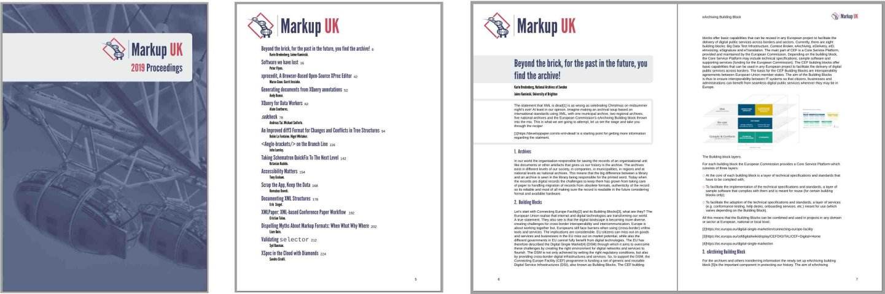
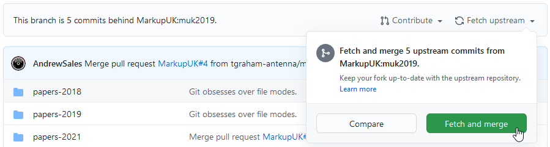

# Markup UK Proceedings

This contains the code for the Markup UK Proceedings, including a couple of files that customise a modified v 1.79 of the DocBook XSLT 1.0 stylesheets. The style of the proceedings is based on the styles of the Markup UK website.



## Working on the 'muk2019' branch

### Getting the code

1. Fork the `MarkupUK/MUK-proc` repository on GitHub
1. Clone the `muk2019` branch of your fork to your computer:
   ```
   git clone --recurse-submodules -b muk2019 https://github.com/your-username/MUK-proc.git
   ```
1. Change directory to the new clone:
   ```
   cd MUK-proc
   ```
1. Format the proceedings and/or make changes to the XML and XSLT

### Formatting the proceedings

Automated formatting requires Apache Ant and AH Formatter.

1. Check that the properties defined in `properties.xml` are correct for your installation.
   - If a property needs to be changed for everyone, edit `properties.xml` and then commit your changes
   - If a property, such as for the location of a file, needs to be changed only for your installation, copy `properties.xml` to `properties.local.xml` and edit that file so that it contains only your property overrides. The definitions in `properties.local.xml` (if it exists) have precedence over the properties in `properties.xml` because Ant reads `properties.local.xml` before `properties.xml`.
   - If you want to set a property only for the current run, specify it on the command line; for example, `-Dforce=yes` to set `${force}` to `yes`.
1. Run Ant:
   ```
   ant -emacs
   ```
   If Ant skips stages because it isn't detecting changes in your files, force all stages to run:
   ```
   ant -emacs -Dforce=yes
   ```

#### Ant targets

The default target is `pdf.single`. To run a different target, specify it on the Ant command line.

- **`pdf.single`** -
  Generate PDF from the DocBook XML file specified by `${single}`.
  The result is generated in the `xsl` directory (at present).
- **`fo.single`** -
  Generate XSL-FO from the DocBook XML file specified by `${single}`. The file can be viewed (on Windows) using the AH Formatter GUI.
  The result is generated in the `xsl` directory (at present).
- **`gui.single`** -
  On Windows only, opens the XSL-FO file from `fo.single` in the AH Formatter GUI. If AH Formatter GUI is already running, the file will open in that GUI. If the file is already open in the GUI, the file will reopen at the current page.

#### Ant properties

- **`${single}`** -
  DocBook XML file to process

### Submitting changes to the `muk2019` branch

When you have changes that are *not* in the `xsl` subdirectory:

1. Make sure that your repository is up to date with `MarkupUK/MUK-proc`:
   1. View the `muk2019` branch of your repository on GitHub in your browser
	  (Reload the page if you got there by using the back button)
   1. If your branch is out of date, there will be an indication of how many commits your branch is behind
   1. Click on 'Fetch upstream' and then 'Fetch and merge' to merge upstream changes into your fork:
	  
   1. Pull those upstream changes to your local repository:
      ```
	  git pull origin muk2019
	  ```
	  You may need to use `git stash` and `git stash pop` before and after the `git pull` to save and restore your local changes to avoid conflicts from the merge
1. Create a new branch for your changes:
   ```
   git checkout -b my-new-branch
   ```
1. Make your changes (if they haven't been made already)
1. Review your changes:
   ```
   git diff
   ```
1. Commit your changes; for example:
   ```
   git add README.md
   git commit -m"Instructions for making changes."
   ```
1. Push your commits to your repository on GitHub:
   ```
   git push -u origin my-new-branch
   ```
1. On GitHub, make a pull request to merge your changes in `my-new-branch` into the `muk2019` branch of `MarkupUK/MUK-proc`

### Submitting changes in the `xsl` directory

That's a whole different kettle of fish...
